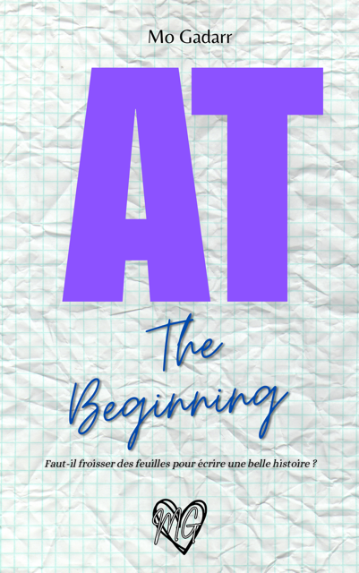

```{=html}
<style>
.ar-page {
    min-height: 100vh;
    background: linear-gradient(160deg, #0A0A0F 0%, #1a0e2e 40%, #2D1B4E 100%);
    display: flex;
    flex-direction: column;
    align-items: center;
    font-family: 'Lato', sans-serif;
    color: #F5E6E0;
    padding: 2rem 1rem 3rem;
}

.ar-header {
    text-align: center;
    max-width: 560px;
    margin-bottom: 1.5rem;
}
.ar-badge {
    display: inline-block;
    font-size: 0.65rem;
    letter-spacing: 3px;
    text-transform: uppercase;
    color: #C9A87C;
    border: 1px solid rgba(201,168,124,0.3);
    padding: 0.35rem 1rem;
    border-radius: 50px;
    margin-bottom: 0.8rem;
}
.ar-header h1 {
    font-family: 'Playfair Display', serif;
    font-size: clamp(1.6rem, 5vw, 2.8rem);
    background: linear-gradient(135deg, #C9A87C, #F5E6E0, #C9A87C);
    -webkit-background-clip: text;
    background-clip: text;
    -webkit-text-fill-color: transparent;
    background-size: 200% auto;
    margin-bottom: 0.5rem;
}
.ar-header p {
    color: rgba(245,230,224,0.55);
    font-size: 0.92rem;
    line-height: 1.7;
}

/* --- Camera stage --- */
.ar-stage {
    position: relative;
    width: 100%;
    max-width: 560px;
    border-radius: 20px;
    overflow: hidden;
    box-shadow: 0 30px 80px rgba(0,0,0,0.6), 0 0 0 1px rgba(201,168,124,0.2);
    background: #0a0a12;
    aspect-ratio: 3/4;
}

#cam-video {
    position: absolute;
    inset: 0;
    width: 100%;
    height: 100%;
    object-fit: cover;
    transform: scaleX(-1); /* mirror for selfie */
    display: none;
}

/* Book overlay — draggable */
#book-overlay {
    position: absolute;
    top: 10%;
    right: 5%;
    width: clamp(90px, 22%, 160px);
    cursor: grab;
    user-select: none;
    touch-action: none;
    border-radius: 6px;
    box-shadow: -6px 6px 20px rgba(0,0,0,0.6), 0 0 0 1px rgba(201,168,124,0.2);
    display: none;
    z-index: 10;
    transition: box-shadow 0.2s;
}
#book-overlay:active { cursor: grabbing; box-shadow: -3px 3px 12px rgba(0,0,0,0.5); }

/* Start overlay */
#start-overlay {
    position: absolute;
    inset: 0;
    display: flex;
    flex-direction: column;
    align-items: center;
    justify-content: center;
    gap: 1rem;
    background: linear-gradient(135deg, rgba(10,10,15,0.97), rgba(45,27,78,0.97));
    text-align: center;
    padding: 2rem;
    z-index: 20;
}
#start-overlay h2 {
    font-family: 'Playfair Display', serif;
    font-size: 1.4rem;
    color: #F5E6E0;
    margin: 0;
}
#start-overlay p {
    font-size: 0.85rem;
    color: rgba(245,230,224,0.5);
    max-width: 270px;
    line-height: 1.6;
    margin: 0;
}

/* Flash on capture */
@keyframes ar-flash { 0%{opacity:0} 20%{opacity:.85} 100%{opacity:0} }
.ar-flash {
    position: absolute;
    inset: 0;
    background: #fff;
    pointer-events: none;
    z-index: 30;
    animation: ar-flash 0.4s ease-out forwards;
    border-radius: 20px;
}

/* Resize handle */
.resize-hint {
    position: absolute;
    bottom: 8%;
    right: 6%;
    width: 22px;
    height: 22px;
    border-right: 2px solid rgba(201,168,124,0.6);
    border-bottom: 2px solid rgba(201,168,124,0.6);
    border-radius: 0 0 4px 0;
    z-index: 11;
    cursor: se-resize;
    display: none;
}

/* Buttons */
.ar-controls {
    display: flex;
    gap: 0.8rem;
    justify-content: center;
    flex-wrap: wrap;
    margin-top: 1rem;
    width: 100%;
    max-width: 560px;
}
.ar-btn {
    display: inline-flex;
    align-items: center;
    gap: 0.5rem;
    padding: 0.85rem 1.8rem;
    border-radius: 50px;
    font-size: 0.9rem;
    font-weight: 700;
    cursor: pointer;
    border: none;
    font-family: 'Lato', sans-serif;
    transition: all 0.3s;
}
.ar-btn:disabled { opacity: 0.5; cursor: not-allowed; }
.ar-btn-start {
    background: linear-gradient(135deg, #7A1B3D, #9B2B55);
    color: #fff;
    box-shadow: 0 6px 25px rgba(122,27,61,0.4);
}
.ar-btn-start:hover:not(:disabled) {
    transform: translateY(-2px);
    box-shadow: 0 10px 35px rgba(122,27,61,0.55);
}
.ar-btn-capture {
    background: rgba(201,168,124,0.12);
    color: #C9A87C;
    border: 1px solid rgba(201,168,124,0.4);
}
.ar-btn-capture:hover { background: rgba(201,168,124,0.22); transform: translateY(-2px); }
.ar-btn-stop {
    background: transparent;
    color: rgba(245,230,224,0.4);
    border: 1px solid rgba(255,255,255,0.08);
    font-size: 0.82rem;
}
.ar-btn-stop:hover { color: #F5E6E0; }

.ar-status {
    text-align: center;
    font-size: 0.72rem;
    letter-spacing: 1px;
    text-transform: uppercase;
    color: rgba(201,168,124,0.5);
    margin-top: 0.6rem;
    min-height: 1.2em;
}

.ar-tips {
    max-width: 560px;
    width: 100%;
    margin-top: 1.5rem;
    display: grid;
    grid-template-columns: repeat(auto-fit, minmax(140px, 1fr));
    gap: 0.8rem;
}
.ar-tip {
    background: rgba(45,27,78,0.2);
    border: 1px solid rgba(201,168,124,0.07);
    border-radius: 12px;
    padding: 0.8rem 1rem;
    font-size: 0.76rem;
    color: rgba(245,230,224,0.45);
    line-height: 1.5;
}
.ar-tip strong {
    display: block;
    color: rgba(201,168,124,0.7);
    font-size: 0.68rem;
    text-transform: uppercase;
    letter-spacing: 1px;
    margin-bottom: 0.25rem;
}

.ar-back { text-align: center; margin-top: 1.5rem; }
.ar-back a {
    color: rgba(201,168,124,0.4);
    font-size: 0.82rem;
    text-decoration: none;
    transition: color 0.2s;
}
.ar-back a:hover { color: #C9A87C; }

#snap-canvas { display: none; }
</style>

<div class="ar-page">

  <div class="ar-header">
    <span class="ar-badge">✦ Expérience exclusive — AT The Beginning</span>
    <h1>Posez avec AT.</h1>
    <p>Une photo, un souvenir inoubliable.<br>Activez votre caméra, glissez le livre, et immortalisez ce moment avec <em>AT The Beginning</em>.</p>
  </div>

  <div class="ar-stage" id="ar-stage">
    <!-- Start screen -->
    <div id="start-overlay">
      <div style="font-size:3rem;">✨</div>
      <h2>Votre photo avec AT vous attend</h2>
      <p>Activez la caméra, placez le livre où vous voulez, et capturez un souvenir que vous garderez.</p>
    </div>

    <!-- Live camera feed -->
    <video id="cam-video" autoplay playsinline muted></video>

    <!-- Draggable / resizable book cover -->
    
    <div class="resize-hint" id="resize-handle" title="Redimensionner"></div>
  </div>

  <div class="ar-controls">
    <button class="ar-btn ar-btn-start" id="start-btn">✨ Activer la caméra</button>
    <button class="ar-btn ar-btn-capture" id="capture-btn" style="display:none;" onclick="capturePhoto()">📷 Capturer</button>
    <button class="ar-btn ar-btn-stop" id="stop-btn" style="display:none;" onclick="stopCamera()">✕ Arrêter</button>
  </div>

  <div class="ar-status" id="ar-status"></div>

  <div class="ar-tips">
    <div class="ar-tip">
      <strong>👆 Positionnez</strong>
      Glissez le livre là où vous le souhaitez — à côté de vous, dans vos mains, où vous voulez !
    </div>
    <div class="ar-tip">
      <strong>↘ Redimensionnez</strong>
      Faites glisser le coin ↘ pour ajuster la taille du livre à votre cadre.
    </div>
    <div class="ar-tip">
      <strong>📸 Capturez</strong>
      Un clic, et votre photo est téléchargée — prête à être partagée !
    </div>
  </div>

  <div class="ar-back">
    <a href="./at_the_beginning.html">← Retour à AT The Beginning</a>
  </div>
</div>

<canvas id="snap-canvas"></canvas>

<script>
(function () {
  var video    = document.getElementById('cam-video');
  var book     = document.getElementById('book-overlay');
  var overlay  = document.getElementById('start-overlay');
  var startBtn = document.getElementById('start-btn');
  var captBtn  = document.getElementById('capture-btn');
  var stopBtn  = document.getElementById('stop-btn');
  var statusEl = document.getElementById('ar-status');
  var resizeH  = document.getElementById('resize-handle');
  var stage    = document.getElementById('ar-stage');
  var stream   = null;

  function setStatus(msg) { statusEl.textContent = msg; }

  // ── Start camera ──────────────────────────────────────────────
  startBtn.addEventListener('click', function () {
    startBtn.disabled = true;
    startBtn.textContent = '…Chargement';
    setStatus('Connexion à la caméra…');

    var constraints = {
      video: { facingMode: 'user', width: { ideal: 720 }, height: { ideal: 960 } },
      audio: false
    };

    navigator.mediaDevices.getUserMedia(constraints)
      .then(function (s) {
        stream = s;
        video.srcObject = s;
        video.play();
        overlay.style.display = 'none';
        video.style.display = 'block';
        book.style.display = 'block';
        resizeH.style.display = 'block';
        captBtn.style.display = 'inline-flex';
        stopBtn.style.display = 'inline-flex';
        startBtn.style.display = 'none';
        setStatus('✦ Glissez le livre pour le positionner à côté de vous');
      })
      .catch(function (err) {
        startBtn.disabled = false;
        startBtn.textContent = '✨ Activer la caméra';
        setStatus('⚠ ' + (err.name === 'NotAllowedError'
          ? 'Autorisation refusée — vérifiez les permissions de la caméra.'
          : err.message || 'Erreur caméra.'));
        console.error(err);
      });
  });

  // ── Stop camera ───────────────────────────────────────────────
  window.stopCamera = function () {
    if (stream) { stream.getTracks().forEach(function (t) { t.stop(); }); stream = null; }
    video.style.display = 'none';
    book.style.display = 'none';
    resizeH.style.display = 'none';
    captBtn.style.display = 'none';
    stopBtn.style.display = 'none';
    startBtn.style.display = 'inline-flex';
    startBtn.disabled = false;
    startBtn.textContent = '✨ Activer la caméra';
    overlay.style.display = 'flex';
    setStatus('');
  };

  // ── Capture photo ─────────────────────────────────────────────
  window.capturePhoto = function () {
    // Flash effect
    var flash = document.createElement('div');
    flash.className = 'ar-flash';
    stage.appendChild(flash);
    setTimeout(function () { if (flash.parentNode) flash.parentNode.removeChild(flash); }, 500);

    var canvas = document.getElementById('snap-canvas');
    var stageW = stage.offsetWidth;
    var stageH = stage.offsetHeight;
    canvas.width = stageW;
    canvas.height = stageH;
    var ctx = canvas.getContext('2d');

    // Draw mirrored video
    ctx.save();
    ctx.translate(stageW, 0);
    ctx.scale(-1, 1);
    ctx.drawImage(video, 0, 0, stageW, stageH);
    ctx.restore();

    // Draw book at its current screen position
    var br = book.getBoundingClientRect();
    var sr = stage.getBoundingClientRect();
    var bx = br.left - sr.left;
    var by = br.top  - sr.top;
    var bw = br.width;
    var bh = br.height;

    var img = new Image();
    img.crossOrigin = 'anonymous';
    img.onload = function () {
      ctx.drawImage(img, bx, by, bw, bh);
      canvas.toBlob(function (blob) {
        if (!blob) { setStatus('⚠ Capture échouée.'); return; }
        var url = URL.createObjectURL(blob);
        var a = document.createElement('a');
        a.href = url;
        a.download = 'AT-The-Beginning-pose.png';
        document.body.appendChild(a);
        a.click();
        document.body.removeChild(a);
        URL.revokeObjectURL(url);
        setStatus('✦ Photo enregistrée !');
        setTimeout(function () { setStatus('✦ Glissez le livre pour le positionner à côté de vous'); }, 3000);
      }, 'image/png');
    };
    img.onerror = function () {
      // If crossorigin fails, draw without book
      canvas.toBlob(function (blob) {
        if (!blob) return;
        var url = URL.createObjectURL(blob);
        var a = document.createElement('a');
        a.href = url; a.download = 'AT-selfie.png';
        document.body.appendChild(a); a.click(); document.body.removeChild(a);
        URL.revokeObjectURL(url);
      }, 'image/png');
    };
    img.src = book.src;
  };

  // ── Drag book (mouse + touch) ─────────────────────────────────
  var dragging = false, dragOffX = 0, dragOffY = 0;

  function getPos(e) {
    if (e.touches) {
      return { x: e.touches[0].clientX, y: e.touches[0].clientY };
    }
    return { x: e.clientX, y: e.clientY };
  }

  book.addEventListener('mousedown',  startDrag);
  book.addEventListener('touchstart', startDrag, { passive: false });

  function startDrag(e) {
    if (e.target === resizeH) return;
    e.preventDefault();
    dragging = true;
    var pos = getPos(e);
    var br = book.getBoundingClientRect();
    dragOffX = pos.x - br.left;
    dragOffY = pos.y - br.top;
    book.style.cursor = 'grabbing';
  }

  document.addEventListener('mousemove',  moveDrag);
  document.addEventListener('touchmove',  moveDrag, { passive: false });

  function moveDrag(e) {
    if (!dragging) return;
    e.preventDefault();
    var pos = getPos(e);
    var sr = stage.getBoundingClientRect();
    var nx = pos.x - sr.left - dragOffX;
    var ny = pos.y - sr.top  - dragOffY;
    // clamp inside stage
    nx = Math.max(0, Math.min(nx, sr.width  - book.offsetWidth));
    ny = Math.max(0, Math.min(ny, sr.height - book.offsetHeight));
    book.style.left   = nx + 'px';
    book.style.top    = ny + 'px';
    book.style.right  = 'auto';
    book.style.bottom = 'auto';
  }

  document.addEventListener('mouseup',  endDrag);
  document.addEventListener('touchend', endDrag);
  function endDrag() { dragging = false; book.style.cursor = 'grab'; }

  // ── Resize handle ─────────────────────────────────────────────
  var resizing = false, resStartW = 0, resStartX = 0;

  resizeH.addEventListener('mousedown',  startResize);
  resizeH.addEventListener('touchstart', startResize, { passive: false });

  function startResize(e) {
    e.preventDefault(); e.stopPropagation();
    resizing = true;
    var pos = getPos(e);
    resStartW = book.offsetWidth;
    resStartX = pos.x;
    // sync resize handle position while resizing
  }

  document.addEventListener('mousemove', moveResize);
  document.addEventListener('touchmove', moveResize, { passive: false });

  function moveResize(e) {
    if (!resizing) return;
    e.preventDefault();
    var pos = getPos(e);
    var newW = Math.max(60, Math.min(resStartW + (pos.x - resStartX), 280));
    book.style.width = newW + 'px';
    // keep resize handle near book corner
    var br = book.getBoundingClientRect();
    var sr = stage.getBoundingClientRect();
    resizeH.style.left   = (br.left - sr.left + newW - 8) + 'px';
    resizeH.style.top    = (br.top  - sr.top  + book.offsetHeight - 8) + 'px';
    resizeH.style.right  = 'auto';
    resizeH.style.bottom = 'auto';
  }

  document.addEventListener('mouseup',  endResize);
  document.addEventListener('touchend', endResize);
  function endResize() { resizing = false; }

})();
</script>
```
