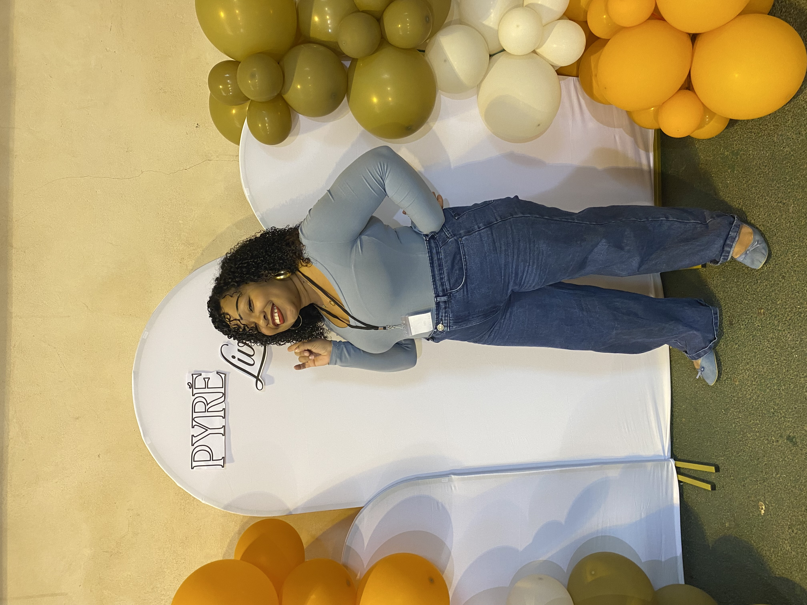
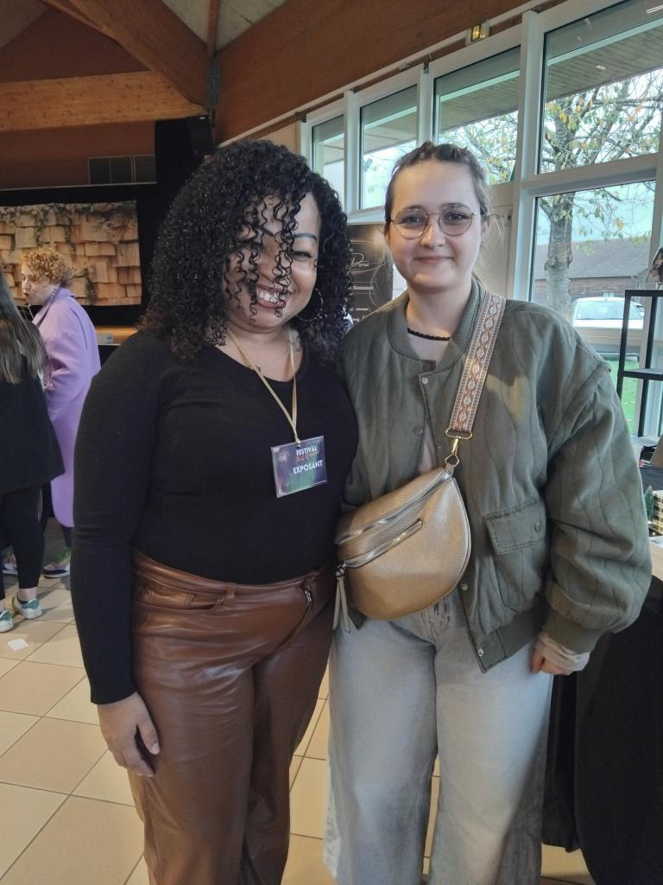
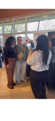

```{=html}
<figure class="editorial-figure fade-in-scroll">
  <div class="editorial-img-wrapper">
    
  </div>
  <figcaption class="editorial-caption">De Thuit Romance à Pyrélivres : des rencontres, des sourires et de belles histoires.</figcaption>
</figure>

<div class="editorial-meta-row">
  <div class="meta-item"><i class="bi bi-chat-heart"></i> Mood: Nostalgique & Comblée</div>
  <div class="meta-item"><i class="bi bi-clock"></i> 4 min read</div>
  <div class="meta-item"><i class="bi bi-journal-check"></i> Retour de Salons</div>
</div>
```

::: {.editorial-intro-lead}
Et me voilà de retour dans mon blog ! Je viens d’enchaîner la rentrée et surtout pas moins de deux salons pendant les vacances. Il s’agissait du salon **`Thuit romance`** ainsi que du salon **`Pyrélivres`**. Deux lieux. Deux ambiances. Cependant, j’y ai retrouvé la même entraide et la même chaleur dans les deux. Là où **`Thuit`** est consacré à la romance sous toutes ses formes, **`Pyrelivres`** est généraliste. C’est une première pour moi !
:::

<div class="editorial-sep">✦ ✦ ✦</div>

::: {.editorial-gallery layout-ncol=3}
{.img-chic-frame}
{.img-chic-frame}
{.img-chic-frame}
:::

Je pense qu’il ne faut pas hésiter à chiner dans ces salons, même quand on se dit qu’on ne va pas trouver ce qu’on aime lire. Les découvertes sont très intéressantes. J’y ai acheté le livre `Héritage` de **Benito Sanchez**. Moi qui adore Stephen King, on est plongé dans un univers à la Shining des plus flippants. Je vous dirai ce que j’en ai pensé.

Aujourd’hui, je suis heureuse ! Je viens de recevoir une très belle nouvelle dont je vous reparlerai par la suite…
     
```{=html}     
<!-- ===== 3) RETOUR ===== -->
<div class="back-home">
  <a href="../blog.qmd" class="btn-back" role="button" aria-label="Retour aux articles de blog">
    <span class="arrow">←</span> Retour aux articles de blog
  </a>
</div>
```
