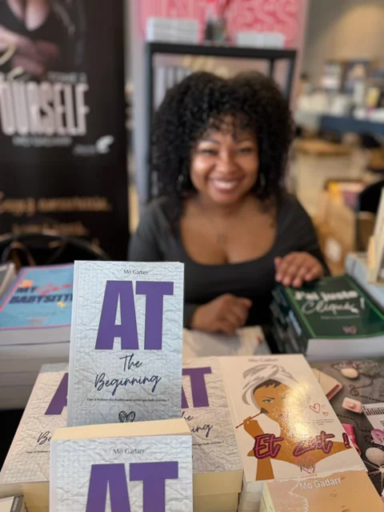
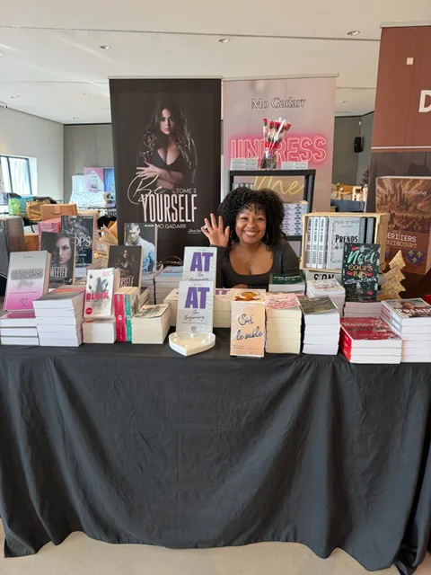
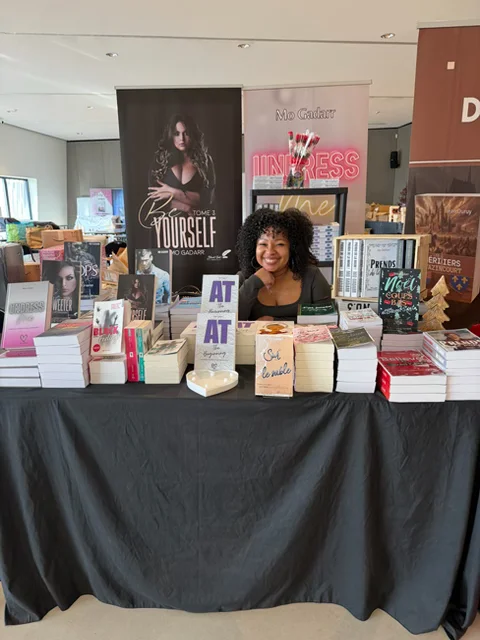

```{=html}
<div class="belgium-futurist-article">

  <p>L'un de mes vieux rêves vient de se réaliser. J'ai passé les frontières françaises pour rencontrer mes lecteurs belges ! Quel bonheur de savoir mes livres entre les mains de potentiels connaisseurs ! Sans compter que je redécouvre la Belgique, si accueillante et belle.</p>

  <p>Reste à savoir si mes histoires plairont. J'espère que oui.</p>

  <p>Si vous êtes dans le coin, passez me faire un coucou et pourquoi pas faire signer votre exemplaire d'<em>AT The Beginning</em> ?</p>

  <p>Je vais dormir : plus qu'un dodo !</p>

  <p>À demain (peut-être) !</p>

  <div class="editorial-sep">✦ ✦ ✦</div>

  <div class="belgium-event-info">
    <div class="event-glow">
      <h3>Salon Love Story Mons</h3>
      <p>🗓️ Du 21 au 22 mars de 10h à 17h</p>
      <p>📍 Palais des congrès, Mons, Belgique</p>
    </div>
  </div>

  <!-- Photo album carousel -->
  <div class="album-carousel" id="belgiumAlbum">
    <div class="album-slides" id="belgiumSlides">
      <div class="album-slide active">
        
      </div>
      <div class="album-slide">
        
      </div>
      <div class="album-slide">
        
      </div>
    </div>

    <button class="album-arrow album-prev" onclick="albumMove(-1)" aria-label="Photo précédente">&#8249;</button>
    <button class="album-arrow album-next" onclick="albumMove(1)" aria-label="Photo suivante">&#8250;</button>

    <div class="album-dots" id="belgiumDots">
      <span class="album-dot active" onclick="albumGoTo(0)"></span>
      <span class="album-dot" onclick="albumGoTo(1)"></span>
      <span class="album-dot" onclick="albumGoTo(2)"></span>
    </div>
    <p class="futurist-gallery-caption">Mons, Belgique · 21 mars 2026</p>
  </div>

  <!-- Lightbox -->
  <div class="album-lightbox" id="belgiumLightbox" onclick="closeLightbox()">
    <span class="lightbox-close" onclick="closeLightbox()">✕</span>
    
  </div>

  <div class="futurist-video-container">
    <video class="futurist-video" autoplay loop muted playsinline>
      <source src="./images/blog/video_converted.mp4" type="video/mp4">
      Votre navigateur ne supporte pas la balise vidéo.
    </video>
  </div>

  <div class="back-home" style="margin-top:2rem;">
    <a href="../blog.qmd" class="btn-back futurist-btn" role="button" aria-label="Retour aux articles de blog">
      <span class="arrow">←</span> Retour aux articles de blog
    </a>
  </div>

</div>

<script>
(function() {
  var current = 0;
  var total = 3;
  var startX = 0;
  var slides = document.getElementById('belgiumSlides');

  window.albumMove = function(dir) {
    current = (current + dir + total) % total;
    updateAlbum();
  };

  window.albumGoTo = function(idx) {
    current = idx;
    updateAlbum();
  };

  function updateAlbum() {
    var allSlides = slides.querySelectorAll('.album-slide');
    var allDots = document.querySelectorAll('#belgiumDots .album-dot');
    allSlides.forEach(function(s, i) { s.classList.toggle('active', i === current); });
    allDots.forEach(function(d, i) { d.classList.toggle('active', i === current); });
  }

  // Touch swipe
  slides.addEventListener('touchstart', function(e) { startX = e.touches[0].clientX; }, {passive: true});
  slides.addEventListener('touchend', function(e) {
    var diff = startX - e.changedTouches[0].clientX;
    if (Math.abs(diff) > 40) albumMove(diff > 0 ? 1 : -1);
  }, {passive: true});

  // Click to open lightbox
  slides.querySelectorAll('.album-img').forEach(function(img) {
    img.addEventListener('click', function() {
      document.getElementById('lightboxImg').src = img.src;
      document.getElementById('belgiumLightbox').classList.add('open');
    });
  });

  window.closeLightbox = function() {
    document.getElementById('belgiumLightbox').classList.remove('open');
  };
})();
</script>
```
