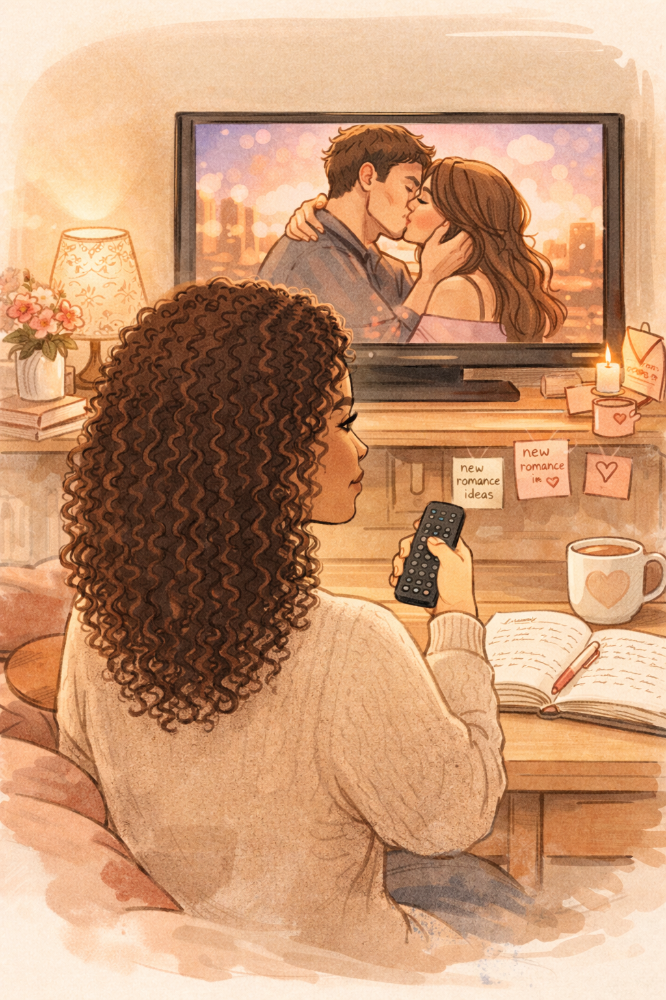

```{=html}
<style>
/* ===== ARTE BLOG POST — JOURNEY STYLE ===== */
.arte-wrapper {
    font-family: 'Lato', sans-serif;
    color: #2a1a1a;
    max-width: 780px;
    margin: 0 auto;
    padding: 0 1.5rem 4rem;
}

/* Hero */
.arte-hero {
    position: relative;
    width: 100%;
    border-radius: 24px;
    overflow: hidden;
    margin-bottom: 3.5rem;
    box-shadow: 0 30px 80px rgba(0,0,0,0.18);
}
.arte-hero img {
    width: 100%;
    display: block;
    object-fit: cover;
    max-height: 520px;
    transition: transform 8s ease;
}
.arte-hero:hover img { transform: scale(1.03); }
.arte-hero-caption {
    position: absolute;
    bottom: 0; left: 0; right: 0;
    padding: 3rem 2rem 1.8rem;
    background: linear-gradient(to top, rgba(42,26,26,0.85), transparent);
    color: rgba(255,255,255,0.9);
    font-size: 0.8rem;
    letter-spacing: 2px;
    text-transform: uppercase;
}

/* Badge */
.arte-badge {
    display: inline-flex;
    align-items: center;
    gap: 0.5rem;
    background: linear-gradient(135deg, #C9A87C, #e8c99a);
    color: #2a1a1a;
    font-size: 0.65rem;
    font-weight: 800;
    letter-spacing: 3px;
    text-transform: uppercase;
    padding: 0.45rem 1.2rem;
    border-radius: 50px;
    margin-bottom: 2rem;
    box-shadow: 0 4px 20px rgba(201,168,124,0.3);
}

/* Title */
.arte-title {
    font-family: 'Playfair Display', serif;
    font-size: clamp(2rem, 5vw, 3.2rem);
    font-weight: 700;
    line-height: 1.15;
    color: #1a0e0e;
    margin: 0 0 0.8rem;
    position: relative;
}
.arte-title::after {
    content: '';
    display: block;
    width: 60px; height: 3px;
    background: linear-gradient(90deg, #C9A87C, #9B2B55);
    border-radius: 2px;
    margin-top: 1rem;
}

/* Lead paragraph */
.arte-lead {
    font-size: 1.2rem;
    line-height: 1.85;
    color: #5a3030;
    margin-bottom: 2.5rem;
    font-style: italic;
    border-left: 3px solid rgba(201,168,124,0.5);
    padding-left: 1.5rem;
}

/* Scene block */
.arte-scene {
    background: linear-gradient(135deg, #fdf8f3, #fef0ec);
    border-radius: 20px;
    padding: 2.2rem 2.5rem;
    margin: 2.5rem 0;
    border: 1px solid rgba(201,168,124,0.15);
    position: relative;
    overflow: hidden;
}
.arte-scene::before {
    content: '🎬';
    position: absolute;
    top: -10px; right: 20px;
    font-size: 4rem;
    opacity: 0.07;
}
.arte-scene p {
    font-size: 1.05rem;
    line-height: 1.9;
    color: #3d2020;
    margin: 0;
}

/* Pull quote */
.arte-quote {
    text-align: center;
    padding: 2.5rem 2rem;
    margin: 3rem 0;
    position: relative;
}
.arte-quote::before {
    content: '❝';
    font-family: 'Playfair Display', serif;
    font-size: 5rem;
    color: rgba(201,168,124,0.2);
    position: absolute;
    top: -0.5rem; left: 50%;
    transform: translateX(-50%);
    line-height: 1;
}
.arte-quote p {
    font-family: 'Playfair Display', serif;
    font-size: clamp(1.3rem, 3vw, 1.8rem);
    font-style: italic;
    color: #7A1B3D;
    line-height: 1.5;
    padding-top: 2rem;
    margin: 0;
}

/* Body text */
.arte-body p {
    font-size: 1.05rem;
    line-height: 1.95;
    color: #3d2020;
    margin-bottom: 1.4rem;
}
.arte-body strong { color: #7A1B3D; font-weight: 700; }

/* Video section */
.arte-video-section {
    margin: 3rem 0;
    border-radius: 20px;
    overflow: hidden;
    box-shadow: 0 20px 60px rgba(0,0,0,0.15);
    position: relative;
    background: #0a0a0f;
}
.arte-video-label {
    position: absolute;
    top: 16px; left: 16px;
    background: rgba(10,10,15,0.8);
    color: #C9A87C;
    font-size: 0.62rem;
    letter-spacing: 2px;
    text-transform: uppercase;
    padding: 0.35rem 0.9rem;
    border-radius: 50px;
    border: 1px solid rgba(201,168,124,0.3);
    z-index: 5;
    backdrop-filter: blur(6px);
}
.arte-video-section video {
    width: 100%;
    display: block;
    max-height: 500px;
    object-fit: contain;
    background: #0a0a0f;
}

/* Divider */
.arte-divider {
    display: flex;
    align-items: center;
    gap: 1rem;
    margin: 2.5rem 0;
}
.arte-divider span:first-child,
.arte-divider span:last-child {
    flex: 1; height: 1px;
    background: linear-gradient(90deg, transparent, rgba(201,168,124,0.3), transparent);
}
.arte-divider span:nth-child(2) {
    color: rgba(201,168,124,0.6);
    font-size: 0.8rem;
}

/* Spoiler reveal */
.arte-spoiler {
    background: linear-gradient(135deg, #7A1B3D08, #9B2B5508);
    border: 1px solid rgba(122,27,61,0.12);
    border-radius: 16px;
    padding: 2rem 2.2rem;
    margin: 2.5rem 0;
    text-align: center;
}
.arte-spoiler .arte-spoiler-label {
    font-size: 0.65rem;
    letter-spacing: 3px;
    text-transform: uppercase;
    color: #9B2B55;
    font-weight: 800;
    margin-bottom: 0.8rem;
}
.arte-spoiler p {
    font-family: 'Playfair Display', serif;
    font-size: 1.4rem;
    color: #7A1B3D;
    margin: 0;
    font-style: italic;
    line-height: 1.5;
}

/* Closing */
.arte-closing {
    margin-top: 3rem;
    padding: 2.5rem;
    background: linear-gradient(135deg, #fdf8f3, #fef0ec);
    border-radius: 20px;
    border: 1px solid rgba(201,168,124,0.15);
    font-size: 1.05rem;
    line-height: 1.9;
    color: #3d2020;
}
.arte-closing em { color: #7A1B3D; font-style: normal; font-weight: 700; }

/* Light mode */
body.quarto-light .arte-wrapper { color: #2a1a1a; }
body.quarto-light .arte-title { color: #1a0e0e; }
body.quarto-light .arte-lead { color: #5a3030; }
body.quarto-light .arte-scene { background: linear-gradient(135deg, #fdf8f3, #fef0ec); }
body.quarto-light .arte-body p,
body.quarto-light .arte-scene p,
body.quarto-light .arte-closing { color: #3d2020; }

/* Dark mode overrides */
body:not(.quarto-light) .arte-wrapper { color: #F5E6E0; }
body:not(.quarto-light) .arte-title { color: #F5E6E0; }
body:not(.quarto-light) .arte-title::after { background: linear-gradient(90deg, #C9A87C, #9B2B55); }
body:not(.quarto-light) .arte-lead { color: rgba(245,230,224,0.7); border-left-color: rgba(201,168,124,0.4); }
body:not(.quarto-light) .arte-scene { background: rgba(45,27,78,0.2); border-color: rgba(201,168,124,0.1); }
body:not(.quarto-light) .arte-scene p { color: rgba(245,230,224,0.8); }
body:not(.quarto-light) .arte-body p { color: rgba(245,230,224,0.8); }
body:not(.quarto-light) .arte-spoiler { background: rgba(122,27,61,0.08); border-color: rgba(122,27,61,0.2); }
body:not(.quarto-light) .arte-closing { background: rgba(45,27,78,0.2); border-color: rgba(201,168,124,0.1); color: rgba(245,230,224,0.8); }

/* Scroll reveal */
.arte-reveal {
    opacity: 0;
    transform: translateY(28px);
    transition: opacity 0.8s ease, transform 0.8s ease;
}
.arte-reveal.visible { opacity: 1; transform: translateY(0); }
</style>

<div class="arte-wrapper">

  <!-- Hero illustration -->
  <div class="arte-hero arte-reveal">
    
    <div class="arte-hero-caption">📺 La scène du crime — reconstitution artistique</div>
  </div>

  <!-- Badge + Title -->
  <div class="arte-reveal">
    <span class="arte-badge">📺 Alerte People</span>
    <h1 class="arte-title">Ma sœur et moi,<br>les nouvelles stars d'Arte !</h1>
  </div>

  <!-- Lead -->
  <p class="arte-lead arte-reveal">
    Il y a des jours où l'on se lève avec une seule ambition : finir ce chapitre récalcitrant et ne pas renverser de café sur son clavier. Et puis, il y a les jours où l'on finit (presque) par accident dans un reportage sur la chaîne la plus culturelle du PAF.
  </p>

  <div class="arte-divider arte-reveal"><span></span><span>✦</span><span></span></div>

  <!-- Scene setting -->
  <div class="arte-scene arte-reveal">
    <p><strong>Le scénario est digne d'un roman :</strong></p>
    <p>Je suis là, tranquillement installée dans mon salon, en train de m'hydrater (parce que l'écriture, ça dessèche, c'est bien connu). Je regarde un reportage passionnant d'Arte sur l'univers de la romance. Je reconnais des copines autrices, des visages croisés en salon… Je souris, je suis dans l'ambiance.</p>
  </div>

  <!-- The video -->
  <div class="arte-video-section arte-reveal">
    <span class="arte-video-label">▶ La preuve par l'image</span>
    <video
      controls
      playsinline
      preload="metadata"
      poster="images/blog/032526/mo_devant_tv.png"
      style="width:100%; max-height:500px; background:#0a0a0f;">
      <source src="images/blog/032526/video_arte.MOV" type="video/mp4">
      Votre navigateur ne supporte pas la lecture vidéo.
    </video>
  </div>

  <!-- Pull quote -->
  <div class="arte-quote arte-reveal">
    <p>Et là, SOUDAIN… l'écran se fige sur deux visages étrangement familiers. 😱</p>
  </div>

  <!-- Spoiler -->
  <div class="arte-spoiler arte-reveal">
    <div class="arte-spoiler-label">⚠ Spoiler</div>
    <p>"Attendez… c'est qui ces deux-là ?"<br>C'est moi ! Et c'est ma sœur !</p>
  </div>

  <div class="arte-divider arte-reveal"><span></span><span>✦</span><span></span></div>

  <!-- Closing -->
  <div class="arte-closing arte-reveal">
    <p>On apparaît en plein cœur de l'action, dignes représentantes du monde de l'édition. Je ne dis pas qu'on a volé la vedette, mais disons qu'Arte a clairement bon goût en matière de figurantes (<em>ou de futures têtes d'affiche, qui sait ?</em>).</p>
  </div>

  <div class="back-home" style="margin-top:2rem;">
    <a href="../blog.html" class="btn-back" role="button" aria-label="Retour aux articles de blog">
      <span class="arrow">←</span> Retour aux articles de blog
    </a>
  </div>

</div>

<script>
(function () {
  var els = document.querySelectorAll('.arte-reveal');
  var obs = new IntersectionObserver(function (entries) {
    entries.forEach(function (e) {
      if (e.isIntersecting) {
        e.target.classList.add('visible');
        obs.unobserve(e.target);
      }
    });
  }, { threshold: 0.12 });
  els.forEach(function (el) { obs.observe(el); });

  // Trigger already-visible elements immediately
  setTimeout(function () {
    document.querySelectorAll('.arte-reveal').forEach(function (el) {
      var r = el.getBoundingClientRect();
      if (r.top < window.innerHeight) el.classList.add('visible');
    });
  }, 100);
})();
</script>
```
