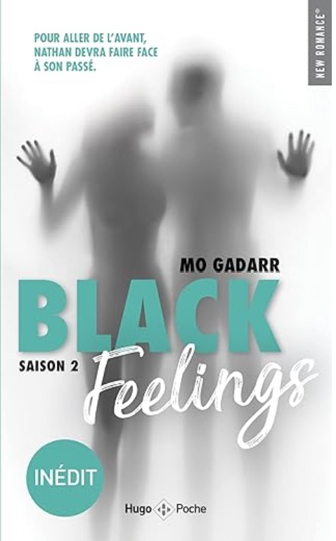
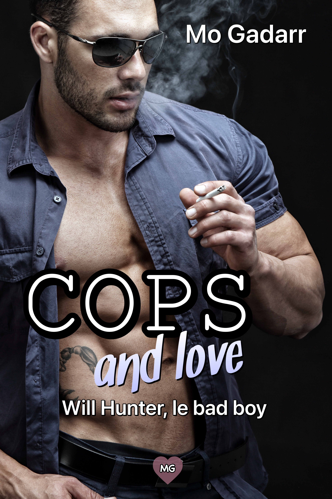
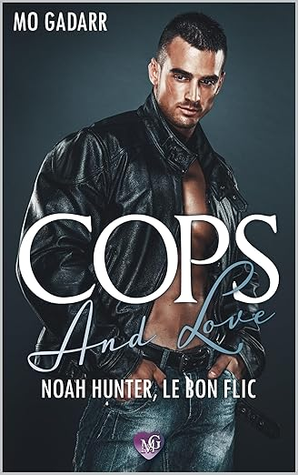
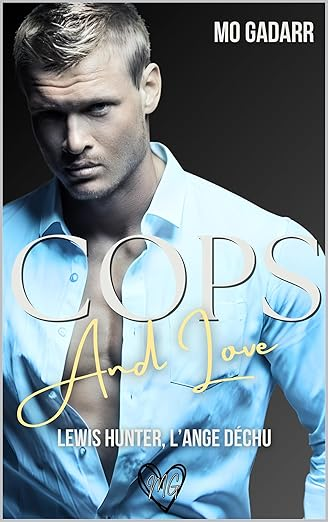
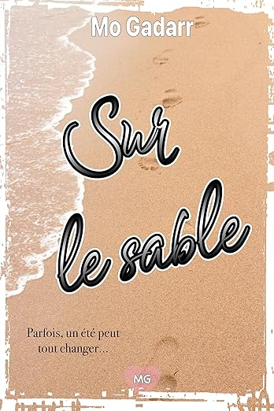
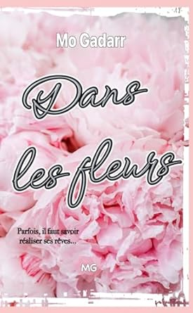
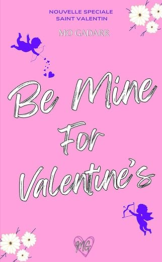
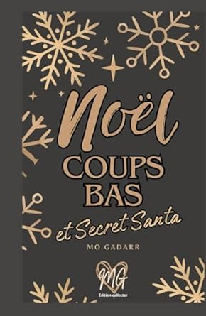

<section class="intro-romans" markdown="1">
### 💕 Les univers de Mo Gadarr
Partez à la découverte des séries, des comédies de Noël, des romances de saison et des one-shots contemporains.
</section>

<nav class="roman-filter" aria-label="Filtrer les rubriques">
  <button class="chip active" data-filter="all" aria-pressed="true">Tout voir</button>
  <button class="chip" data-filter="edition" aria-pressed="false">Édition</button>
  <button class="chip" data-filter="series" aria-pressed="false">Séries</button>
  <button class="chip" data-filter="fetes" aria-pressed="false">Fêtes</button>
  <button class="chip" data-filter="oneshots" aria-pressed="false">One-shots</button>
  <button class="chip" data-filter="archive" aria-pressed="false">Archives</button>
</nav>

    <!-- ÉDITION -->
    

        <a href="romans/black-feelings-1.qmd" class="vignette-link">
            
            

                Romance • Suspense
                <h3 class="vignette-title">Black Feelings — Saison 1</h3>
                Découvrir &rarr;
            

        </a>
    

    

        <a href="romans/black-feelings-2.qmd" class="vignette-link">
            
            

                Romance • Suspense
                <h3 class="vignette-title">Black Feelings — Saison 2</h3>
                Découvrir &rarr;
            

        </a>
    

    

        <a href="romans/be-sweeter.qmd" class="vignette-link">
            
            

                New Adult • Campus
                <h3 class="vignette-title">Be Sweeter</h3>
                Découvrir &rarr;
            

        </a>
    

    

        <a href="romans/be-stronger.qmd" class="vignette-link">
            
            

                New Adult • Résilience
                <h3 class="vignette-title">Be Stronger</h3>
                Découvrir &rarr;
            

        </a>
    

    

        <a href="romans/be-yourself.qmd" class="vignette-link">
            
            

                New Adult • Identité
                <h3 class="vignette-title">Be Yourself</h3>
                Découvrir &rarr;
            

        </a>
    

    <!-- SÉRIES -->
    

        <a href="romans/cops-and-love-will-hunter.qmd" class="vignette-link">
            
            

                Romantic Suspense
                <h3 class="vignette-title">Cops & Love : Will Hunter</h3>
                Découvrir &rarr;
            

        </a>
    

    

        <a href="romans/cops-love-noah.qmd" class="vignette-link">
            
            

                Romantic Suspense
                <h3 class="vignette-title">Cops & Love : Noah Hunter</h3>
                Découvrir &rarr;
            

        </a>
    

    

        <a href="romans/cops-love-lewis.qmd" class="vignette-link">
            
            

                Romantic Suspense
                <h3 class="vignette-title">Cops & Love : Lewis Hunter</h3>
                Découvrir &rarr;
            

        </a>
    

    

        <a href="romans/sur-le-sable.qmd" class="vignette-link">
            
            

                Romance d'été
                <h3 class="vignette-title">Sur le sable</h3>
                Découvrir &rarr;
            

        </a>
    

    

        <a href="romans/dans-les-fleurs.qmd" class="vignette-link">
            
            

                Romance de printemps
                <h3 class="vignette-title">Dans les fleurs</h3>
                Découvrir &rarr;
            

        </a>
    

    

        <a href="romans/en-pleine-nature.qmd" class="vignette-link">
            
            

                Romance d'automne
                <h3 class="vignette-title">En pleine nature</h3>
                Découvrir &rarr;
            

        </a>
    

    <!-- FÊTES -->
    

        <a href="romans/believe-in-santa-klaus.qmd" class="vignette-link">
            
            

                Comédie de Noël
                <h3 class="vignette-title">Believe in (Santa) Klaus</h3>
                Découvrir &rarr;
            

        </a>
    

    

        <a href="romans/be-mine-valentine.qmd" class="vignette-link">
            
            

                Romance Saint-Valentin
                <h3 class="vignette-title">Be Mine For Valentine</h3>
                Découvrir &rarr;
            

        </a>
    

    

        <a href="romans/poupee-bimbo.qmd" class="vignette-link">
            
            

                Comédie Romantique
                <h3 class="vignette-title">Homme sérieux recherche poupée Bimbo</h3>
                Découvrir &rarr;
            

        </a>
    

    

        <a href="romans/noel-princesse-licorne.qmd" class="vignette-link">
            
            

                Comédie Déjantée
                <h3 class="vignette-title">À Noël, je serai une princesse licorne !</h3>
                Découvrir &rarr;
            

        </a>
    

    

        <a href="romans/noel-coups-bas.qmd" class="vignette-link">
            
            

                Enemis-to-Lovers
                <h3 class="vignette-title">Noël, coups bas et Secret Santa</h3>
                Découvrir &rarr;
            

        </a>
    

    <!-- ONE-SHOTS -->
    

        <a href="romans/my-sweet-babysitter.qmd" class="vignette-link">
            
            

                Romance Maman Solo
                <h3 class="vignette-title">My Sweet Babysitter</h3>
                Découvrir &rarr;
            

        </a>
    

    

        <a href="romans/jai-juste-clique.qmd" class="vignette-link">
            
            

                Romance 2.0
                <h3 class="vignette-title">J’ai juste cliqué !</h3>
                Découvrir &rarr;
            

        </a>
    

    

        <a href="romans/et-zut.qmd" class="vignette-link">
            
            

                Romance Gourmande
                <h3 class="vignette-title">Et zut !</h3>
                Découvrir &rarr;
            

        </a>
    

    

        <a href="romans/undress-me.qmd" class="vignette-link">
            
            

                Romance Sexy
                <h3 class="vignette-title">Undress Me</h3>
                Découvrir &rarr;
            

        </a>
    

    <!-- ARCHIVES -->
    

        <a href="romans/blind.qmd" class="vignette-link">
            
            

                Co-écriture • Dark
                <h3 class="vignette-title">Blind</h3>
                Consulter &rarr;
            

        </a>
    

    

        <a href="romans/hurt.qmd" class="vignette-link">
            
            

                Co-écriture • Dark
                <h3 class="vignette-title">Hurt</h3>
                Consulter &rarr;
            

        </a>
    

  <a href="../index.qmd" class="btn-back" role="button" aria-label="Retour à l’accueil">
    ← Retour à l’accueil
  </a>

<!-- ===== JS: FILTRAGE GRID ===== -->

