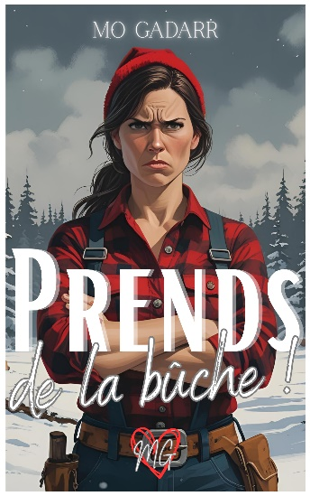

```{=html}
<section class="intro-romans">
  <h3>💕 Les univers de Mo Gadarr</h3>
  <p>Partez à la découverte des séries, des comédies de Noël, des romances de saison et des one-shots contemporains.</p>
</section><nav class="roman-filter" id="romanFilter" aria-label="Filtrer les rubriques">
  <div class="rf-track">
    <button class="rf-tab active" data-filter="all" aria-pressed="true">
      <span class="rf-icon">✦</span><span class="rf-label">Tout</span>
    </button>
    <button class="rf-tab" data-filter="dernier" aria-pressed="false">
      <span class="rf-icon">🔥</span><span class="rf-label">Dernier</span>
    </button>
    <button class="rf-tab" data-filter="edition" aria-pressed="false">
      <span class="rf-icon">📖</span><span class="rf-label">Édition</span>
    </button>
    <button class="rf-tab" data-filter="series" aria-pressed="false">
      <span class="rf-icon">📚</span><span class="rf-label">Séries</span>
    </button>
    <button class="rf-tab" data-filter="fetes" aria-pressed="false">
      <span class="rf-icon">🎄</span><span class="rf-label">Fêtes</span>
    </button>
    <button class="rf-tab" data-filter="oneshots" aria-pressed="false">
      <span class="rf-icon">💎</span><span class="rf-label">One-shots</span>
    </button>
    <div class="rf-indicator" id="rfIndicator"></div>
  </div>
</nav>

<div class="library-grid">

    <!-- DERNIER ROMAN -->
    <div class="book-vignette fade-in-scroll" data-cat="dernier">
        <a href="dernier_roman/at_the_beginning.html" class="vignette-link">
            
            <div class="vignette-overlay">
                <span class="vignette-genre">Romance Sombre • Drame</span>
                <h3 class="vignette-title">AT — The Beginning</h3>
                <span class="vignette-action">Découvrir &rarr;</span>
            </div>
        </a>
    </div>

    <!-- ÉDITION -->
    <div class="book-vignette fade-in-scroll" data-cat="edition">
        <a href="romans/black-feelings-1.html" class="vignette-link">
            
            <div class="vignette-overlay">
                <span class="vignette-genre">Romance • Suspense</span>
                <h3 class="vignette-title">Black Feelings — Saison 1</h3>
                <span class="vignette-action">Découvrir &rarr;</span>
            </div>
        </a>
    </div>

    <div class="book-vignette fade-in-scroll" data-cat="edition">
        <a href="romans/black-feelings-2.html" class="vignette-link">
            
            <div class="vignette-overlay">
                <span class="vignette-genre">Romance • Suspense</span>
                <h3 class="vignette-title">Black Feelings — Saison 2</h3>
                <span class="vignette-action">Découvrir &rarr;</span>
            </div>
        </a>
    </div>

    <div class="book-vignette fade-in-scroll" data-cat="edition">
        <a href="romans/be-sweeter.html" class="vignette-link">
            
            <div class="vignette-overlay">
                <span class="vignette-genre">New Adult • Campus</span>
                <h3 class="vignette-title">Be Sweeter</h3>
                <span class="vignette-action">Découvrir &rarr;</span>
            </div>
        </a>
    </div>

    <div class="book-vignette fade-in-scroll" data-cat="edition">
        <a href="romans/be-stronger.html" class="vignette-link">
            
            <div class="vignette-overlay">
                <span class="vignette-genre">New Adult • Résilience</span>
                <h3 class="vignette-title">Be Stronger</h3>
                <span class="vignette-action">Découvrir &rarr;</span>
            </div>
        </a>
    </div>

    <div class="book-vignette fade-in-scroll" data-cat="edition">
        <a href="romans/be-yourself.html" class="vignette-link">
            
            <div class="vignette-overlay">
                <span class="vignette-genre">New Adult • Identité</span>
                <h3 class="vignette-title">Be Yourself</h3>
                <span class="vignette-action">Découvrir &rarr;</span>
            </div>
        </a>
    </div>

    <!-- SÉRIES -->
    <div class="book-vignette fade-in-scroll" data-cat="series">
        <a href="romans/cops-and-love-will-hunter.html" class="vignette-link">
            
            <div class="vignette-overlay">
                <span class="vignette-genre">Romantic Suspense</span>
                <h3 class="vignette-title">Cops & Love : Will Hunter</h3>
                <span class="vignette-action">Découvrir &rarr;</span>
            </div>
        </a>
    </div>

    <div class="book-vignette fade-in-scroll" data-cat="series">
        <a href="romans/cops-love-noah.html" class="vignette-link">
            
            <div class="vignette-overlay">
                <span class="vignette-genre">Romantic Suspense</span>
                <h3 class="vignette-title">Cops & Love : Noah Hunter</h3>
                <span class="vignette-action">Découvrir &rarr;</span>
            </div>
        </a>
    </div>

    <div class="book-vignette fade-in-scroll" data-cat="series">
        <a href="romans/cops-love-lewis.html" class="vignette-link">
            
            <div class="vignette-overlay">
                <span class="vignette-genre">Romantic Suspense</span>
                <h3 class="vignette-title">Cops & Love : Lewis Hunter</h3>
                <span class="vignette-action">Découvrir &rarr;</span>
            </div>
        </a>
    </div>

    <div class="book-vignette fade-in-scroll" data-cat="series">
        <a href="romans/sur-le-sable.html" class="vignette-link">
            
            <div class="vignette-overlay">
                <span class="vignette-genre">Romance d'été</span>
                <h3 class="vignette-title">Sur le sable</h3>
                <span class="vignette-action">Découvrir &rarr;</span>
            </div>
        </a>
    </div>

    <div class="book-vignette fade-in-scroll" data-cat="series">
        <a href="romans/dans-les-fleurs.html" class="vignette-link">
            
            <div class="vignette-overlay">
                <span class="vignette-genre">Romance de printemps</span>
                <h3 class="vignette-title">Dans les fleurs</h3>
                <span class="vignette-action">Découvrir &rarr;</span>
            </div>
        </a>
    </div>

    <div class="book-vignette fade-in-scroll" data-cat="series">
        <a href="romans/en-pleine-nature.html" class="vignette-link">
            
            <div class="vignette-overlay">
                <span class="vignette-genre">Romance d'automne</span>
                <h3 class="vignette-title">En pleine nature</h3>
                <span class="vignette-action">Découvrir &rarr;</span>
            </div>
        </a>
    </div>

    <!-- FÊTES -->
    <div class="book-vignette fade-in-scroll" data-cat="fetes">
        <a href="dernier_roman/prends_buche.html" class="vignette-link">
            
            <div class="vignette-overlay">
                <span class="vignette-genre">Romance de Noël • Enemies to Lovers</span>
                <h3 class="vignette-title">Prends de la bûche</h3>
                <span class="vignette-action">Découvrir &rarr;</span>
            </div>
        </a>
    </div>

    <div class="book-vignette fade-in-scroll" data-cat="fetes">
        <a href="romans/believe-in-santa-klaus.html" class="vignette-link">
            
            <div class="vignette-overlay">
                <span class="vignette-genre">Comédie de Noël</span>
                <h3 class="vignette-title">Believe in (Santa) Klaus</h3>
                <span class="vignette-action">Découvrir &rarr;</span>
            </div>
        </a>
    </div>

    <div class="book-vignette fade-in-scroll" data-cat="fetes">
        <a href="romans/be-mine-valentine.html" class="vignette-link">
            
            <div class="vignette-overlay">
                <span class="vignette-genre">Romance Saint-Valentin</span>
                <h3 class="vignette-title">Be Mine For Valentine</h3>
                <span class="vignette-action">Découvrir &rarr;</span>
            </div>
        </a>
    </div>

    <div class="book-vignette fade-in-scroll" data-cat="fetes">
        <a href="romans/poupee-bimbo.html" class="vignette-link">
            
            <div class="vignette-overlay">
                <span class="vignette-genre">Comédie Romantique</span>
                <h3 class="vignette-title">Homme sérieux recherche poupée Bimbo</h3>
                <span class="vignette-action">Découvrir &rarr;</span>
            </div>
        </a>
    </div>

    <div class="book-vignette fade-in-scroll" data-cat="fetes">
        <a href="romans/noel-princesse-licorne.html" class="vignette-link">
            
            <div class="vignette-overlay">
                <span class="vignette-genre">Comédie Déjantée</span>
                <h3 class="vignette-title">À Noël, je serai une princesse licorne !</h3>
                <span class="vignette-action">Découvrir &rarr;</span>
            </div>
        </a>
    </div>

    <div class="book-vignette fade-in-scroll" data-cat="fetes">
        <a href="romans/noel-coups-bas.html" class="vignette-link">
            
            <div class="vignette-overlay">
                <span class="vignette-genre">Enemis-to-Lovers</span>
                <h3 class="vignette-title">Noël, coups bas et Secret Santa</h3>
                <span class="vignette-action">Découvrir &rarr;</span>
            </div>
        </a>
    </div>

    <!-- ONE-SHOTS -->
    <div class="book-vignette fade-in-scroll" data-cat="oneshots">
        <a href="romans/my-sweet-babysitter.html" class="vignette-link">
            
            <div class="vignette-overlay">
                <span class="vignette-genre">Romance Maman Solo</span>
                <h3 class="vignette-title">My Sweet Babysitter</h3>
                <span class="vignette-action">Découvrir &rarr;</span>
            </div>
        </a>
    </div>

    <div class="book-vignette fade-in-scroll" data-cat="oneshots">
        <a href="romans/jai-juste-clique.html" class="vignette-link">
            
            <div class="vignette-overlay">
                <span class="vignette-genre">Romance 2.0</span>
                <h3 class="vignette-title">J'ai juste cliqué !</h3>
                <span class="vignette-action">Découvrir &rarr;</span>
            </div>
        </a>
    </div>

    <div class="book-vignette fade-in-scroll" data-cat="oneshots">
        <a href="romans/et-zut.html" class="vignette-link">
            
            <div class="vignette-overlay">
                <span class="vignette-genre">Romance Gourmande</span>
                <h3 class="vignette-title">Et zut !</h3>
                <span class="vignette-action">Découvrir &rarr;</span>
            </div>
        </a>
    </div>

    <div class="book-vignette fade-in-scroll" data-cat="oneshots">
        <a href="romans/undress-me.html" class="vignette-link">
            
            <div class="vignette-overlay">
                <span class="vignette-genre">Romance Sexy</span>
                <h3 class="vignette-title">Undress Me</h3>
                <span class="vignette-action">Découvrir &rarr;</span>
            </div>
        </a>
    </div>


</div>

<div class="back-home">
  <a href="index.html" class="btn-back" role="button" aria-label="Retour à l'accueil">
    <span class="arrow">←</span> Retour à l'accueil
  </a>
</div>

<!-- ===== JS: FILTRAGE GRID + INDICATOR ===== -->
<script>
document.addEventListener('DOMContentLoaded', () => {
    const KEY = "mogadarr.romanFilter";
    const tabs = document.querySelectorAll(".rf-tab");
    const vignettes = document.querySelectorAll(".book-vignette");
    const indicator = document.getElementById("rfIndicator");
    const track = document.querySelector(".rf-track");

    function moveIndicator(tab) {
        const trackRect = track.getBoundingClientRect();
        const tabRect = tab.getBoundingClientRect();
        indicator.style.width = tabRect.width + 'px';
        indicator.style.transform = 'translateX(' + (tabRect.left - trackRect.left + track.scrollLeft) + 'px)';
    }

    function scrollTabIntoView(tab) {
        const trackWidth = track.offsetWidth;
        const tabLeft = tab.offsetLeft;
        const tabWidth = tab.offsetWidth;
        // Center the tab in the visible area
        const scrollTarget = tabLeft - (trackWidth / 2) + (tabWidth / 2);
        track.scrollTo({ left: scrollTarget, behavior: 'smooth' });
        // Re-adjust indicator after scroll finishes
        setTimeout(() => moveIndicator(tab), 350);
    }

    function applyFilter(category) {
        vignettes.forEach(v => {
            if (category === "all" || v.dataset.cat === category) {
                v.style.display = "block";
                setTimeout(() => v.style.opacity = "1", 50);
            } else {
                v.style.opacity = "0";
                setTimeout(() => { v.style.display = "none"; }, 300);
            }
        });
    }

    // Restore last selection
    const saved = localStorage.getItem(KEY) || "all";
    tabs.forEach(t => {
        if (t.dataset.filter === saved) {
            t.classList.add("active");
            t.setAttribute("aria-pressed", "true");
        } else {
            t.classList.remove("active");
            t.setAttribute("aria-pressed", "false");
        }
    });
    applyFilter(saved);

    // Position indicator + scroll into view after layout
    requestAnimationFrame(() => {
        const activeTab = document.querySelector('.rf-tab.active');
        if (activeTab) {
            moveIndicator(activeTab);
            scrollTabIntoView(activeTab);
        }
    });

    tabs.forEach(tab => {
        tab.addEventListener("click", () => {
            tabs.forEach(t => { t.classList.remove("active"); t.setAttribute("aria-pressed", "false"); });
            tab.classList.add("active");
            tab.setAttribute("aria-pressed", "true");
            moveIndicator(tab);
            scrollTabIntoView(tab);
            const cat = tab.dataset.filter;
            applyFilter(cat);
            localStorage.setItem(KEY, cat);
        });
    });

    // Reposition on resize
    window.addEventListener('resize', () => {
        const activeTab = document.querySelector('.rf-tab.active');
        if (activeTab) moveIndicator(activeTab);
    });

    // Reposition indicator on manual scroll
    track.addEventListener('scroll', () => {
        const activeTab = document.querySelector('.rf-tab.active');
        if (activeTab) moveIndicator(activeTab);
    });
});
</script>
```

```{=html}
<!-- Floating Mobile Navigation -->
<div class="mobile-nav-actions" id="mobileNav">
  <a href="index.html" class="nav-btn-floating btn-nav-home" aria-label="Retour à l'accueil">
    <i class="bi bi-house-heart-fill"></i>
  </a>
  <button id="backToTopBtn" class="nav-btn-floating" aria-label="Retour en haut">
    <i class="bi bi-arrow-up-short"></i>
  </button>
</div>

<script>
document.addEventListener('DOMContentLoaded', () => {
    const mobileNav = document.getElementById('mobileNav');
    const backToTopBtn = document.getElementById('backToTopBtn');

    // Show/Hide on scroll
    window.addEventListener('scroll', () => {
        if (window.scrollY > 500) {
            mobileNav.classList.add('visible');
        } else {
            mobileNav.classList.remove('visible');
        }
    });

    // Smooth scroll to top
    backToTopBtn.addEventListener('click', () => {
        window.scrollTo({
            top: 0,
            behavior: 'smooth'
        });
    });
});
</script>
```
