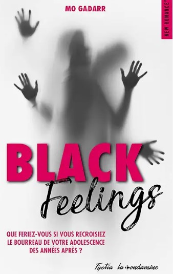

💞₊⊹₊⊹      ₊⊹₊⊹💞₊⊹

```{=html}
<header class="book-hero">
    <div class="book-hero-bg" style="background-image: url('../images/couvertures/black-feelings-tome-1.jpg');"></div>
    <div class="book-hero-content">
        <div class="book-hero-card fade-in">
            <div class="book-hero-cover-wrapper">
                
            </div>
            <div class="book-hero-info">
                <span class="book-genre-pill">Romance Contemporaine • Drame</span>
                <h1>Black Feelings — Tome 1</h1>
                <p class="book-tagline">Victime de harcèlement scolaire au lycée, Amandine ne sera plus jamais la même.</p>
                
                <div class="formats-prix-premium">
                    <div class="format-item">
                        <span class="format-name">Ebook</span>
                        <span class="format-price">2,99 €</span>
                    </div>
                    <div class="format-item">
                        <span class="format-name">Broché</span>
                        <span class="format-price">14 €</span>
                    </div>
                    <div class="format-item">
                        <span class="format-name">Relié</span>
                        <span class="format-price">18 €</span>
                    </div>
                </div>

                <div class="book-synopsis">
<p>Victime de harcèlement scolaire au lycée, Amandine ne sera plus jamais la même !</p>
<p>Si Mandy a voulu devenir professeure de français, c'est certes par passion pour l'enseignement, mais aussi et surtout, pour sensibiliser les jeunes au harcèlement scolaire. Elle-même victime de ce phénomène pendant ses années lycée, elle veut à tout prix éviter qu'il se reproduise.</p>
<p>Cependant, lorsqu'elle découvre que son ancien bourreau est un de ses collègues, tout bascule. Elle s'est fait une promesse : se venger de lui quelles qu'en soient les conséquences. Elle n'a dès lors plus qu'un objectif en tête : le séduire pour mieux le détruire !</p>
</div>

<div class="book-actions">
                    <a href="https://www.amazon.fr/s?k=Mo+Gadarr+Black+Feelings" class="btn-primary" target="_blank">Acheter sur Amazon</a>
                    <a href="extraits/extrait-black-feelings1.html" class="btn-text">Lire un extrait</a>
                
    <a href="../romans.html" class="btn-text"><i class="bi bi-arrow-left"></i> Retour</a>
</div>
            </div>
        </div>
    </div>
</header>


```{=html}
<!-- Floating Mobile Navigation -->
<div class="mobile-nav-actions" id="mobileNav">
  <button id="backToTopBtn" class="nav-btn-floating" aria-label="Retour en haut">
    <i class="bi bi-arrow-up-short"></i>
  </button>
</div>

<script>
document.addEventListener('DOMContentLoaded', () => {
    const mobileNav = document.getElementById('mobileNav');
    const backToTopBtn = document.getElementById('backToTopBtn');

    if (mobileNav && backToTopBtn) {
        window.addEventListener('scroll', () => {
            if (window.scrollY > 500) {
                mobileNav.classList.add('visible');
            } else {
                mobileNav.classList.remove('visible');
            }
        });

        backToTopBtn.addEventListener('click', () => {
            window.scrollTo({
                top: 0,
                behavior: 'smooth'
            });
        });
    }
});
</script>
```
